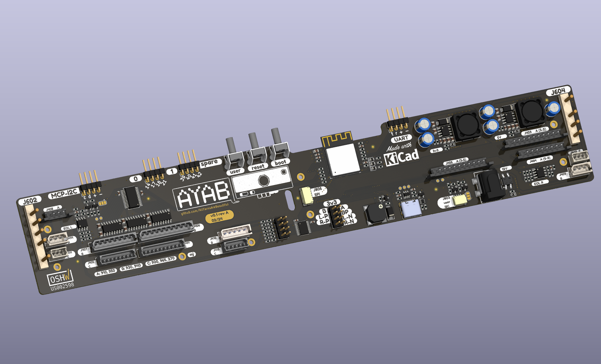

# AYAB-ESP32
These are the design files for the latest generation of AYAB hardware, a new, next controller for knitting machines.\
It currently has compatibility with the Brother KH-900, 910, 930, 940, 950, 965, with support planned for CK-35 and KH-270.\
Based on the ESP32, many new features have been implemented: 

* Supports all carriages (K, L, and G)
* Can be powered from internal Brother power supply, or 9-12V DC barrel jack of any polarity.
* PC connection via USB-C, with future web-app planned for "wireless" use.
* Qwiic I2C connector available for user expansion or accessories (color changer, motorized carriage, etc)
* 8 User-accessible GPIO brought out on 2.54mm headers.
* 1 User-programmable button.
* Hackable - access to the solenoid control bus from outside devices for direct control of the machine.
* Friendly design for assembly. Single-sided PCB with minimum package size of 0603 and optimized BOM.
* OSHW certified design!

The project was designed using KiCad 7. All symbols, footprints, and models are self contained to this repository so no additional files are required in order to view or modify the design.

Questions? Comments? Great ideas? Talk with us in [#hardware-development on Discord](https://discord.gg/A8KE3jcCn2)!