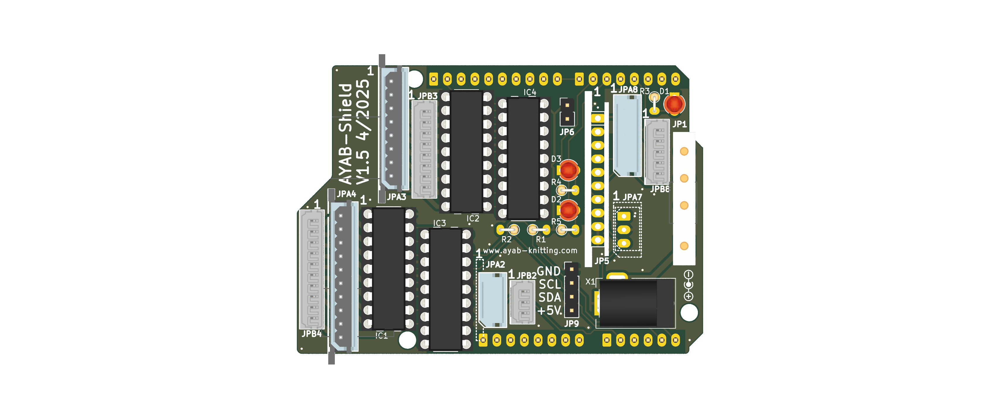

# AYAB Shield
This is the original design for the AYAB hardware. It is a board in a shield form factor intended to be used with Arduino Uno type development boards. It should be compatible with Uno R2, R3, and R4. 
This shield can be built in a variety of configurations that allow for compatiblity with Brother KH 270, 900, 910, 930, 940, 950, 965.

The files required to order/build the board can be found 

The project was designed using KiCad 9. All symbols, footprints, and 3D models are self-contained to the repository.

Questions? Comments? Great ideas? Talk with us in [#hardware-development on Discord](https://discord.gg/A8KE3jcCn2)!